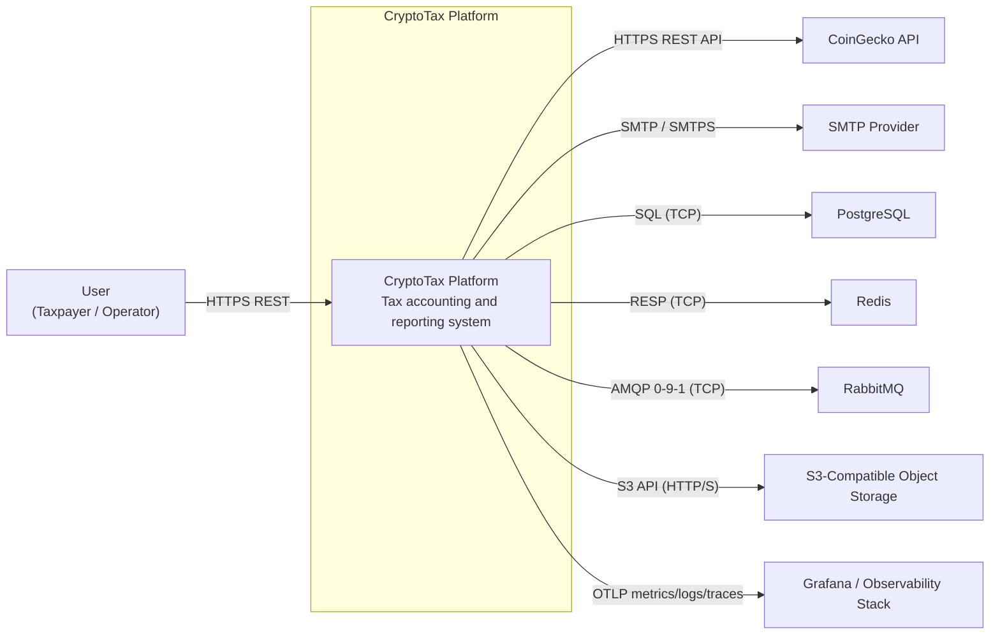
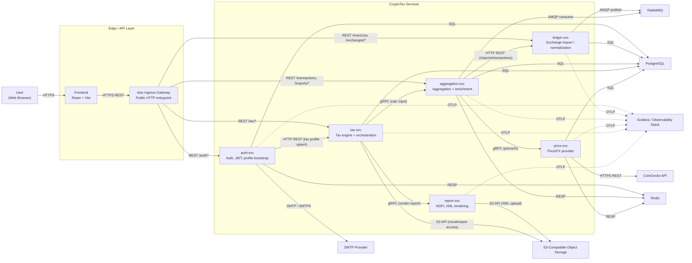

# CryptoTax Platform — C4 (L1 + L2)

## L1 — System Context

## L2 — Container Diagram

## Scope Notes

- Диаграмма объединяет сервисы из двух репозиториев (`CryptoTax-Go` и `CryptoTax`) как единую систему.
- На L2 показаны контейнеры и внешние зависимости без детализации внутренних модулей сервисов.
- Для читаемости используются только основные пользовательские и межсервисные потоки.
